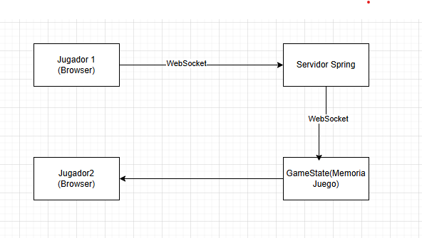
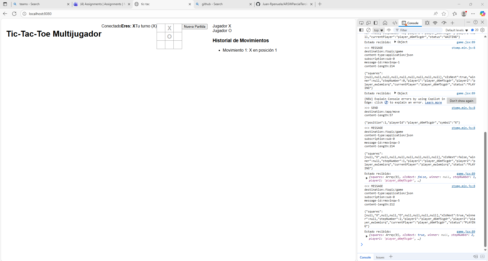
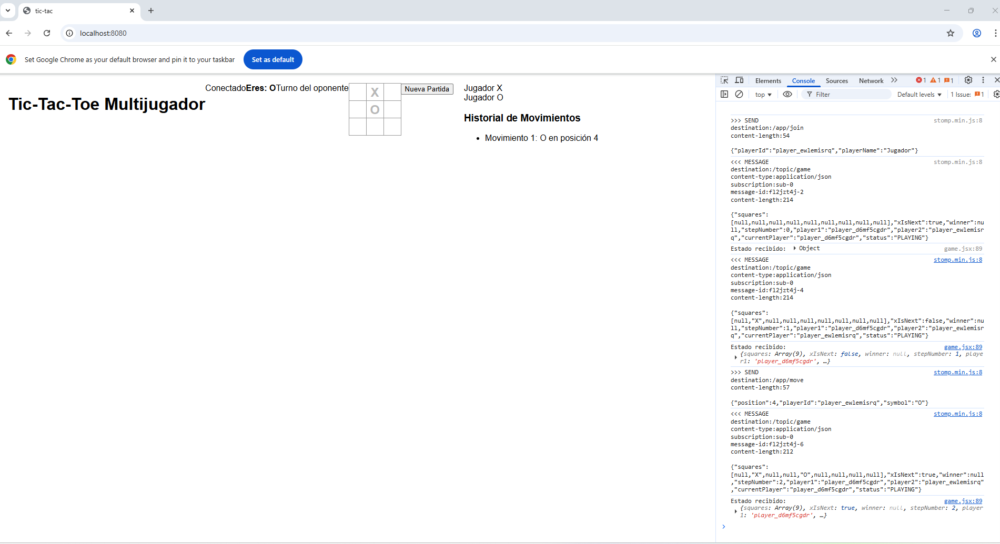

# ARSWParcialTercio2

## Como correrlo
- git clone https://github.com/Juan-Rpenuela/ARSWParcialTercio2.git
- cd ARSWParcialTercio2
- mvn clean package
- ingresa a "localhost:8080/index.html" desde 2 navegadores diferentes

## Arquitectura

## Flujo

1. Jugador 1 se conecta
   - WebSocket establece conexión
   - Se envía mensaje /app/join
   - Servidor asigna como Player1 (X)
   - Broadcast a /topic/game

2. Jugador 2 se conecta
   - WebSocket establece conexión
   - Se envía mensaje /app/join
   - Servidor asigna como Player2 (O)
   - Juego cambia a estado PLAYING
   - Broadcast a /topic/game

3. Jugador 1 hace clic en casilla
   -> Se valida turno localmente
   -> Se envía /app/move con posición
   - Servidor valida movimiento
   - Actualiza estado del juego
   - Verifica ganador
   - Broadcast nuevo estado a /topic/game

4. Ambos jugadores reciben actualización
   - React actualiza estado local
   - Re-renderiza tablero
   - Cambia indicador de turno

## Funcionamiento
# Jugador 1

# Jugador 2
